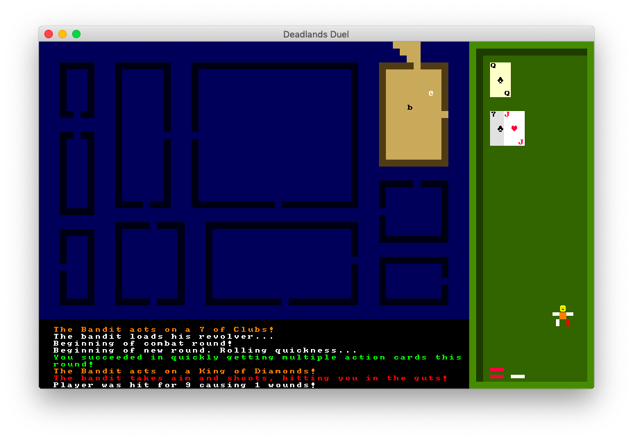

#### The as-yet inaccurately named
# Deadlands Duel
## A roguelike, sort of, in very early stages

***

This mostly-personal project is an attempt to learn about [the Deadlands Classic TTRPG](https://www.peginc.com/store/deadlands-classic-20th-anniversary-edition/) and [the Python port of libtcod](https://github.com/libtcod/python-tcod) by smashing the two together, repeatedly and stubbornly.

[The slightly outdated libtcod tutorial](http://rogueliketutorials.com/tutorials/tcod/) has been indispensable, and using [PyDealer](https://github.com/Trebek/pydealer) for representing playing cards has saved me a lot of work.

The deeper I get into this project, the more I am convinced of the fundamental error of trying to make a beginner-dev roguelike out of a system like Deadlands Classic, where much of the appeal is the mechanical choices and multiple paths at every step of play.

That being said, it's at least at the point where you can stroll around a simple collection of buildings, exchanging gunfire with immobile bandits.  Doing so is a good lesson in how badly your performance is affected by your character's traits and negative modifiers for distance and motion.  It's a bit prone to crashing if you do smart things like run away from multiple bandits, though.

Deadlands Classic has rules for movie-style duels, high noon, middle of a dusty street, staring down your opponent and unsettling them enough for a quickdraw advantage. Currently, these are completely unimplemented in this project.

***

###### While not directly incorporated into the project, [REXpaint](https://www.gridsagegames.com/rexpaint/) and [Atom](https://atom.io/) nonetheless make my work easier.
